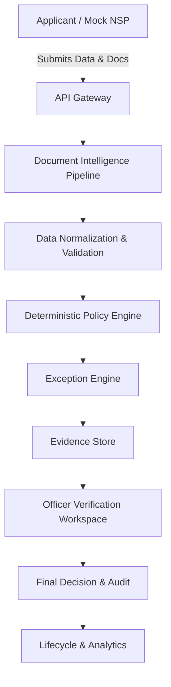

# Architecture

## 1. High-Level Architecture
The system acts as a verification layer sitting between the Applicant/Portals and the ultimate Disbursement systems.



## 2. Frontend Architecture
- **Next.js** for SSR/SSG and routing.
- **React** components using **shadcn/ui** and **Tailwind CSS**.
- Dedicated contexts for RBAC and Workspace state management.

## 3. Backend Architecture
- **FastAPI** serving REST APIs.
- Domain-driven design separating core logic (Policy, Documents, Lifecycle).
- **SQLAlchemy** for ORM interacting with PostgreSQL.

## 4. Verification Run Architecture
Applications undergo versioned verification runs to ensure historical results are not overwritten upon correction.

```
Application
    ↓
Verification Run
    ├── Extraction Results
    ├── Validation Results
    ├── Policy Results
    ├── Exceptions
    └── Evidence
```
A new verification run must be created when the applicant submits corrected documents and verification is run again.

## 5. AI Pipeline
AI/LLM is NOT automatically invoked for every document. Used only where it provides value.

```
PDF/Image
 ↓
File inspection
 ↓
Text available?
 ├── YES → direct text extraction
 └── NO → OCR
              ↓
       structured extraction
              ↓
       LLM/VLM only when required
              ↓
       normalized fields
```

## 6. Policy Engine Architecture
A deterministic rules engine evaluating JSON/YAML based policy schemas. The hierarchy is:
`Scheme → Academic Year → Policy Version → Rule Set → Rule → Evaluation`

Each rule conceptually supports:
- `rule_id`, `rule_type`, `parameters`
- `effective_from`, `effective_to`, `policy_version`
- `source_document`, `source_page`, `source_reference`
- `severity`, `evaluation_type`

## 7. Evidence Store
The Evidence Store must preserve evidence required to explain findings.
Example conceptual evidence structure:
```json
{
  "field": "dob",
  "value": "12-04-2004",
  "source_document": "marksheet.pdf",
  "page": 1,
  "bounding_box": "...",
  "rule_id": "DOC-CONSISTENCY-DOB-001",
  "policy_version": "PM-2026-V1",
  "result": "MISMATCH"
}
```

## 8. Verification Workflow


## 9. Officer Workflow
- Dashboard → Exception Queue → Application Workspace → Review Evidence → Submit Final Administrative Decision (e.g., Request Correction or Approve/Reject).

## 10. Applicant Workflow
- Dashboard → Upload Docs → Pre-flight checks → Submit → Track Lifecycle → Respond to Corrections (triggers new Verification Run).

## 11. Database Architecture
- **PostgreSQL** for relational data (Applications, Verification Runs, Policies, Users, Audit Logs, Evidence).

## 12. Storage Architecture
- **S3-compatible Object Storage** (MinIO for local dev) for storing raw documents and OCR artifacts.

## 13. Background Processing
- **Celery** workers backed by **Redis** for heavy OCR and extraction tasks.

## 14. Authentication/RBAC
- **JWT** based authentication.
- Strict Role-Based Access Control.

## 15. Audit Architecture
- Append-only audit logs in PostgreSQL linking User, Action, Rule, Evidence, and Verification Run.

## 16. Future Government Integration Architecture
- API Boundaries defined for NSP (Ingestion), DBT/PFMS (Disbursement), and DigiLocker/API Setu (Document Fetching). Prototype integrations will be mocked.

## 17. Deployment Architecture
- Dockerized containers (Frontend, Backend, Celery Worker, Redis, Postgres, MinIO).

## 18. CLEAR SEPARATION OF CONCERNS
**AI / Document Layer**
- OCR, Classification, Extraction, Normalization assistance, Matching assistance, Anomaly/exception assistance, Natural-language explanation

**Policy Layer**
- Official deterministic rules, Scheme, Academic year, Policy version, Eligibility, Document requirements

**Human Layer**
- Review, Request correction, Approve/reject where applicable, Final administrative decision

**Core principle:**
AI ASSISTS. RULES GOVERN. OFFICER DECIDES.
